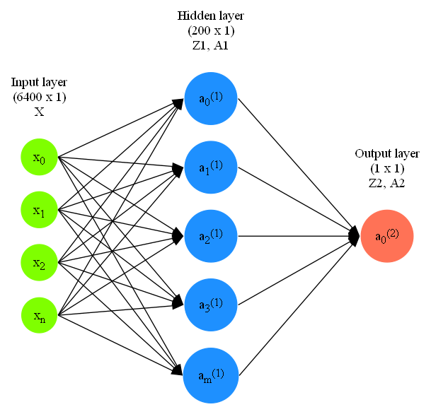

# Trains an agent with (stochastic) Policy Gradients on Pong


Based on this awesome blog post from the great Andrej Kaparthy: https://karpathy.github.io/2016/05/31/rl/  

## Install
Create a virtual env and activate it.  
```python -m venv venv```  
```source venv/bin/activate```  
Install requirements.  
```pip install -r requirements.txt```  
Then install the gym.  
```pip install "gym[atari]"```  
Accept licences.  
```pip install "gym[accept-rom-license, atari]"```
## Run
```python src/pong.py"```  

## Architecture

Weights  
W1: (200 x 6400)  
W2: (1 x 200)  

## Math


## References
[Andrej Kaparthy blog](https://karpathy.github.io/2016/05/31/rl/) 


